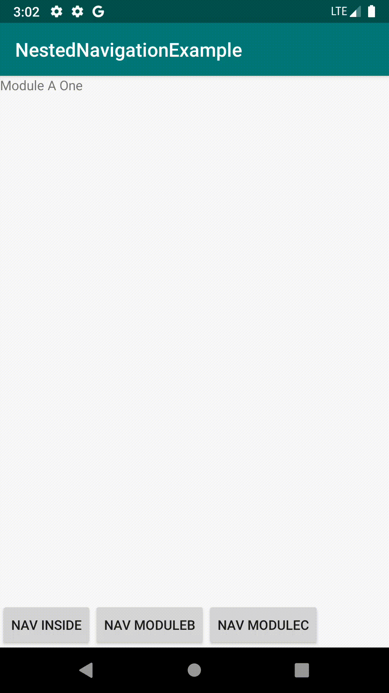

# NestedNavigationExample

We only need one `NavHostFragment` at app module and each module doesn't need to have their own `NavHostFragment`.

- [nav_graph][n0]
- [nav_graph_module_a][na]
- [nav_graph_module_c][nc] 
- [nav_graph_module_b][nb]

[n0]: ./app/src/main/res/navigation/nav_graph.xml
[na]: ./modulea/src/main/res/navigation/nav_graph_module_a.xml
[nb]: ./moduleb/src/main/res/navigation/nav_graph_module_b.xml
[nc]: ./modulec/src/main/res/navigation/nav_graph_module_c.xml

